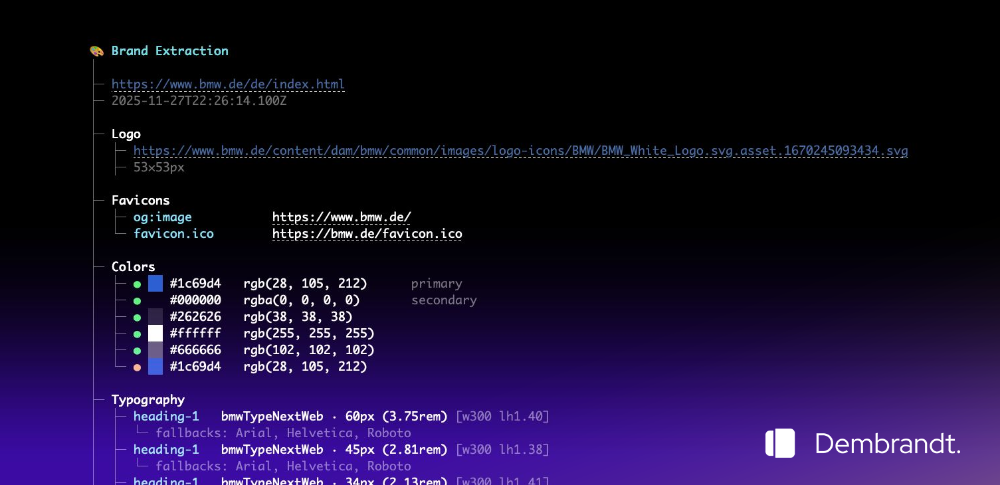

# Dembrandt.

[](https://www.npmjs.com/package/dembrandt)
[](https://www.npmjs.com/package/dembrandt)
[](https://github.com/dembrandt/dembrandt/blob/main/LICENSE)

Extract any website’s design system into design tokens in a few seconds: logo, colors, typography, borders, and more. One command.



## Install

Install globally: `npm install -g dembrandt`

```bash
dembrandt bmw.de
```

Or use npx without installing: `npx dembrandt bmw.de`

Requires Node.js 18+

## Quick Start

### Try It (Test the Output)

```bash
# 1. One-off test — no install
npx dembrandt stripe.com

# 2. Inspect raw JSON
npx dembrandt stripe.com --json-only | head -100

# 3. Save and browse in Local UI
npx dembrandt stripe.com --save-output
cd local-ui && npm install && node server.js & npm run dev
# Open http://localhost:5173
```

### Use It (CLI in Your Workflow)

```bash
npm install -g dembrandt   # or: npm install dembrandt
dembrandt mysite.com --save-output --dtcg
# Output: output/mysite.com/TIMESTAMP.json (and .tokens.json)
```

### Use It (Library in Another Project)

```bash
npm install dembrandt
```

```js
import { extractBrand } from 'dembrandt/api';

const brand = await extractBrand('https://client-store.myshopify.com', {
  slow: true,      // for Shopify themes
  explore: true,   // product/collection pages
});
// brand.colors, brand.typography, brand.logo, etc.
```

### Example: marysquare.com (Shopify store)

Here's a concrete example. Run this command:

```bash
npx dembrandt marysquare.com --save-output
```

**What it does:** Dembrandt launches a headless browser, loads marysquare.com, waits for the page to fully render (including any JavaScript), then extracts design tokens from the live DOM. With `--save-output`, it writes two files:

1. **`output/marysquare.com/TIMESTAMP.json`** — Full extraction as JSON (colors, typography, logo URLs, button styles, breakpoints, etc.)
2. **`output_markdown/marysquare.com.md`** — A human-readable style guide you can use for popups, marketing templates, or UI components

**What you get:** For marysquare.com, the extraction returns things like:

- **Logo** — 200×25px favicon asset URL
- **Colors** — Primary palette (#81c6bc, #8ed3c7, #be2119, #ff005d, etc.)
- **Typography** — ivy-presto-display (48px headlines), Raleway (14px body)
- **CTAs** — Button specs: teal primary (#8ed3c7), gray secondary (#dddddd), border-radius 999px
- **Breakpoints** — 30 responsive breakpoints
- **Frameworks** — Tailwind, UIkit, Headless UI, etc.

Because marysquare.com is a Shopify store, Dembrandt also explores product/collection pages (via `--explore`, on by default) to capture colors and styles from across the site.

## What to expect from extraction?

- Colors (semantic, palette, CSS variables)
- Typography (fonts, sizes, weights, sources)
- Spacing (margin/padding scales)
- Borders (radius, widths, styles, colors)
- Shadows
- Components (buttons, badges, inputs, links)
- Breakpoints
- Icons & frameworks

## Usage

```bash
dembrandt <url>                    # Basic extraction (terminal display only)
dembrandt bmw.de --json-only       # Output raw JSON to terminal (no formatted display, no file save)
dembrandt bmw.de --save-output     # Save JSON to output/bmw.de/YYYY-MM-DDTHH-MM-SS.json
dembrandt bmw.de --dtcg            # Export in W3C Design Tokens (DTCG) format (auto-saves as .tokens.json)
dembrandt bmw.de --dark-mode       # Extract colors from dark mode variant
dembrandt bmw.de --mobile          # Use mobile viewport (390x844, iPhone 12/13/14/15) for responsive analysis
dembrandt bmw.de --slow            # 3x longer timeouts (24s hydration) for JavaScript-heavy sites
dembrandt bmw.de --no-sandbox      # Disable Chromium sandbox (required for Docker/CI)
dembrandt bmw.de --browser=firefox # Use Firefox instead of Chromium (better for Cloudflare bypass)
dembrandt bmw.de --include-wordpress-presets  # Include WordPress block theme --wp--preset colors
```

Default: formatted terminal display only. Use `--save-output` to persist results as JSON files. Browser automatically retries in visible mode if headless extraction fails.

### Shopify & WordPress Sites

Dembrandt works well on Shopify and WordPress storefronts. Use these tips for best results:

**Shopify:**
- `--explore` (default on) targets `/products`, `/collections`, `/shop` — ideal for storefronts
- Use `--slow` for Dawn or heavy themes with lots of JavaScript
- Use `--browser=firefox` if stores use Cloudflare or bot protection

**WordPress:**
- Use `--slow` for plugin-heavy sites (WooCommerce, page builders)
- Use `--include-wordpress-presets` to include `--wp--preset` CSS variables from block themes (theme.json colors)
- Use `--browser=firefox` for hosts with aggressive bot protection

### Browser Selection

By default, dembrandt uses Chromium. If you encounter bot detection or timeouts (especially on sites behind Cloudflare), try Firefox which is often more successful at bypassing these protections:

```bash
# Use Firefox instead of Chromium
dembrandt bmw.de --browser=firefox

# Combine with other flags
dembrandt bmw.de --browser=firefox --save-output --dtcg
```

**When to use Firefox:**
- Sites behind Cloudflare or other bot detection systems
- Timeout issues on heavily protected sites
- WSL environments where headless Chromium may struggle

**Installation:**
Firefox browser is installed automatically with `npm install`. If you need to install manually:

```bash
npx playwright install firefox
```

### W3C Design Tokens (DTCG) Format

Use `--dtcg` to export in the standardized [W3C Design Tokens Community Group](https://www.designtokens.org/) format:

```bash
dembrandt stripe.com --dtcg
# Saves to: output/stripe.com/TIMESTAMP.tokens.json
```

The DTCG format is an industry-standard JSON schema that can be consumed by design tools and token transformation libraries like [Style Dictionary](https://styledictionary.com).

## Local UI

Browse your extracted brands in a visual interface.

### Setup

```bash
cd local-ui
npm install
```

### Running

Start both the API server and UI:

```bash
# Terminal 1: Start API server (port 3001)
node server.js

# Terminal 2: Start UI dev server (port 5173)
npm run dev
```

Open http://localhost:5173 to browse saved extractions.

### Features

- Visual grid of all extracted brands
- Color palettes with click-to-copy
- Typography specimens
- Spacing, shadows, border radius visualization
- Button and link component previews
- Dark/light theme toggle
- Section nav links on extraction pages — jump directly to Colors, Typography, Shadows, etc. via a sticky sidebar

Extractions are performed via CLI (`dembrandt <url> --save-output`) and automatically appear in the UI.

## Programmatic API

Use Dembrandt as a library to fetch brand tokens from code:

```js
import { extractBrand } from 'dembrandt/api';

const brand = await extractBrand('https://example.com', {
  darkMode: false,
  mobile: false,
  explore: true,      // product/category pages (Shopify, etc.)
  slow: false,        // 3x timeouts for slow sites
  browser: 'chromium', // or 'firefox'
  noSandbox: false,   // set true for Docker/CI
  includeWordPressPresets: false,  // include --wp--preset for WordPress block themes
});

console.log(brand.colors, brand.typography, brand.logo);
```

Options mirror CLI flags. Requires Node.js 18+ and Playwright browsers (`npx playwright install` if needed).

## Use Cases

- Brand audits & competitive analysis
- Design system documentation
- Reverse engineering brands
- Multi-site brand consolidation
- **Shopify/WordPress agencies:** Extract client brand tokens for popups, marketing templates, and UI components
- **Engineers:** Programmatically fetch brand data for multi-site tooling or design system sync

## How It Works

Uses Playwright to render the page, extracts computed styles from the DOM, analyzes color usage and confidence, groups similar typography, detects spacing patterns, and returns actionable design tokens.

### Extraction Process

1. Browser Launch - Launches browser (Chromium by default, Firefox optional) with stealth configuration
2. Anti-Detection - Injects scripts to bypass bot detection
3. Navigation - Navigates to target URL with retry logic
4. Hydration - Waits for SPAs to fully load (8s initial + 4s stabilization)
5. Content Validation - Verifies page content is substantial (>500 chars)
6. Parallel Extraction - Runs all extractors concurrently for speed
7. Analysis - Analyzes computed styles, DOM structure, and CSS variables
8. Scoring - Assigns confidence scores based on context and usage

### Color Confidence

- High — Logo, brand elements, primary buttons
- Medium — Interactive elements, icons, navigation
- Low — Generic UI components (filtered from display)
- Only shows high and medium confidence colors in terminal. Full palette in JSON.

## Limitations

- Dark mode requires --dark-mode flag (not automatically detected)
- Hover/focus states extracted from CSS (not fully interactive)
- Canvas/WebGL-rendered sites cannot be analyzed (e.g., Tesla, Apple Vision Pro demos)
- JavaScript-heavy sites require hydration time (8s initial + 4s stabilization)
- Some dynamically-loaded content may be missed
- Default viewport is 1920x1080 (use --mobile for 390x844 iPhone viewport)

## Ethics & Legality

Dembrandt extracts publicly available design information (colors, fonts, spacing) from website DOMs for analysis purposes. This falls under fair use in most jurisdictions (USA's DMCA § 1201(f), EU Software Directive 2009/24/EC) when used for competitive analysis, documentation, or learning.

Legal: Analyzing public HTML/CSS is generally legal. Does not bypass protections or violate copyright. Check site ToS before mass extraction.

Ethical: Use for inspiration and analysis, not direct copying. Respect servers (no mass crawling), give credit to sources, be transparent about data origin.

## Contributing

Bugs you found? Weird websites that make it cry? Pull requests (even one-liners make me happy)?

Spam me in [Issues](https://github.com/dembrandt/dembrandt/issues) or PRs. I reply to everything.

Let's keep the light alive together.

@thevangelist

---

MIT — do whatever you want with it.
